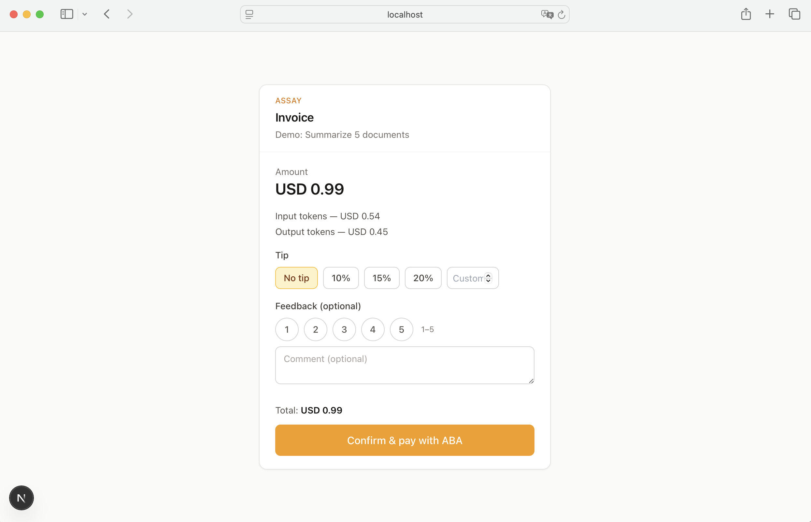

# Assay

Open-source AI quality measurement: invoice URLs, tipping, feedback, and **ABA (PayWay)** payments. Self-hosted on Supabase + [PayWay](https://www.payway.com.kh/).



---

## Quick start

```bash
git clone https://github.com/ailixr/assay-open.git
cd assay
npm install
cp .env.example .env.local
```

Edit `.env.local` with your Supabase and PayWay credentials, then run migrations and start:

```bash
# Run migrations in Supabase SQL Editor (see Setup below)
npm run dev
```

Create an API key and an invoice:

```bash
npm run seed:key
curl -X POST http://localhost:3000/api/invoices \
  -H "Authorization: Bearer ask_xxxxx" \
  -H "Content-Type: application/json" \
  -d '{"task":{"description":"Test task"},"cost":{"total":1.50,"currency":"USD"}}'
```

---

## Setup

You need **Supabase** (database + auth) and **PayWay** (ABA payments). Grab credentials from each and put them in `.env.local`.

### Supabase

1. Create a project: [supabase.com](https://supabase.com) → New project.
2. **Project Settings → API**: copy **Project URL** → `NEXT_PUBLIC_SUPABASE_URL`, **service_role** (secret) → `SUPABASE_SERVICE_ROLE_KEY`.
3. **SQL Editor**: run the migrations in order (e.g. copy from `src/lib/supabase/migrations/001_initial.sql`, then `002_invoice_feedback_schema.sql`).

### PayWay (ABA)

1. Sign up and get credentials: [payway.com.kh](https://www.payway.com.kh/).
2. In `.env.local` set:
   - `PAYWAY_MERCHANT_ID` — from your PayWay dashboard.
   - `PAYWAY_API_KEY` — API key from PayWay.
   - `PAYWAY_BASE_URL` — e.g. `https://checkout-sandbox.payway.com.kh` (sandbox) or production URL.

Optional: `PAYWAY_WEBHOOK_SECRET` for webhook verification. Your app’s webhook URL: `ASSAY_BASE_URL/api/webhooks/payway`.

### Assay

- `ASSAY_API_KEY_SALT` — random string for hashing API keys (`openssl rand -hex 24`).
- `ASSAY_BASE_URL` — public URL of this app (e.g. `http://localhost:3000` for dev).

---

## Environment variables

| Variable | Description |
|----------|-------------|
| `NEXT_PUBLIC_SUPABASE_URL` | Supabase project URL |
| `SUPABASE_SERVICE_ROLE_KEY` | Supabase service role key |
| `PAYWAY_MERCHANT_ID` | PayWay merchant ID |
| `PAYWAY_API_KEY` | PayWay API key |
| `PAYWAY_BASE_URL` | PayWay checkout URL (sandbox or production) |
| `ASSAY_API_KEY_SALT` | Salt for API key hashing |
| `ASSAY_BASE_URL` | App public URL (invoice links, webhooks) |

See `.env.example` for a template.

---

## API

**Auth:** `Authorization: Bearer ask_xxxxx` (create keys with `npm run seed:key`).

| Method | Path | Description |
|--------|------|-------------|
| POST | `/api/invoices` | Create invoice. Returns `id`, `invoice_url`, `status`, etc. |
| GET | `/api/invoices` | List invoices (API key). |
| GET | `/api/invoices/public/[id]` | Public invoice (for the invoice page). |
| POST | `/api/invoices/[id]/tip-feedback` | Submit tip + optional rating/comment. |
| POST | `/api/invoices/[id]/create-payment` | Create ABA (PayWay) payment link. |
| POST | `/api/webhooks/payway` | PayWay webhook (payment confirmation). |
| GET | `/api/export/dpo` | DPO export (chosen/rejected pairs). |

### Create invoice (POST /api/invoices)

```json
{
  "task": { "description": "Summarize the documents" },
  "cost": {
    "line_items": [
      { "label": "Input tokens", "amount": 0.24 },
      { "label": "Output tokens", "amount": 0.12 }
    ],
    "total": 0.36,
    "currency": "USD"
  },
  "feedback": {
    "categories": [{ "key": "accuracy", "label": "Accuracy" }],
    "tags": [{ "key": "helpful", "label": "Helpful", "sentiment": "positive" }]
  },
  "options": { "expires_in_hours": 72, "tip_presets": [0, 0.1, 0.15, 0.2] }
}
```

Required: `task.description`, `cost.total`, `cost.currency`. Rest optional.

---

## Flow

1. Create invoice via API → get `invoice_url`.
2. Payer opens link → sees amount, tip, feedback options → confirms.
3. App creates ABA payment link (PayWay) → payer pays → webhook marks invoice paid.

---

## License

MIT — see [LICENSE](LICENSE).
